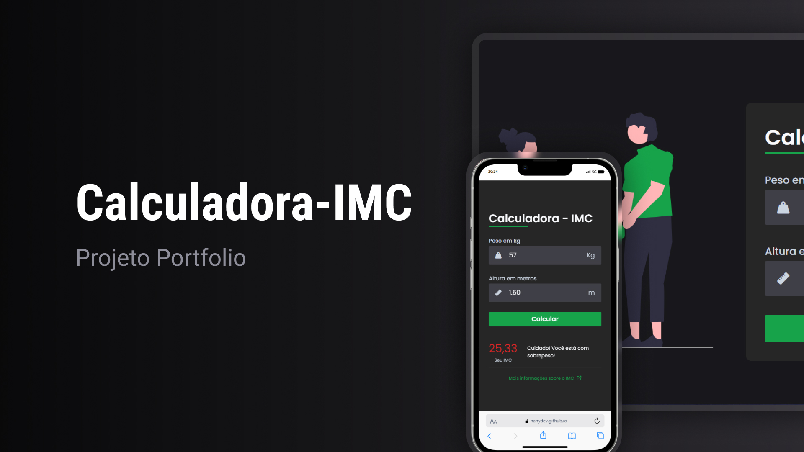

<h1 align="center"> Calculadora - IMC </h1>

programa gratuito para acessar seu IMC, sendo responsivo e podendo ser acessado em qualquer dispositivo!

  <a href="#-tecnologias">Tecnologias</a>&nbsp;&nbsp;&nbsp;|&nbsp;&nbsp;&nbsp;
  <a href="#-projeto">Projeto</a>&nbsp;&nbsp;&nbsp;|&nbsp;&nbsp;&nbsp;
  <a href="#memo-licença">Licença</a>

  

 

  

## 🚀 Tecnologias

Esse projeto foi desenvolvido com as seguintes tecnologias:

- HTML e CSS
- JavaScript
- Git e Github
- Figma

## 💻 Projeto

A Calculadora de IMC é a forma mais prática de acompanhar seu peso ideal!

## :memo: Licença

Esse projeto está sob a licença MIT.

---

Feito com ♥ by NanyDev :wave:
